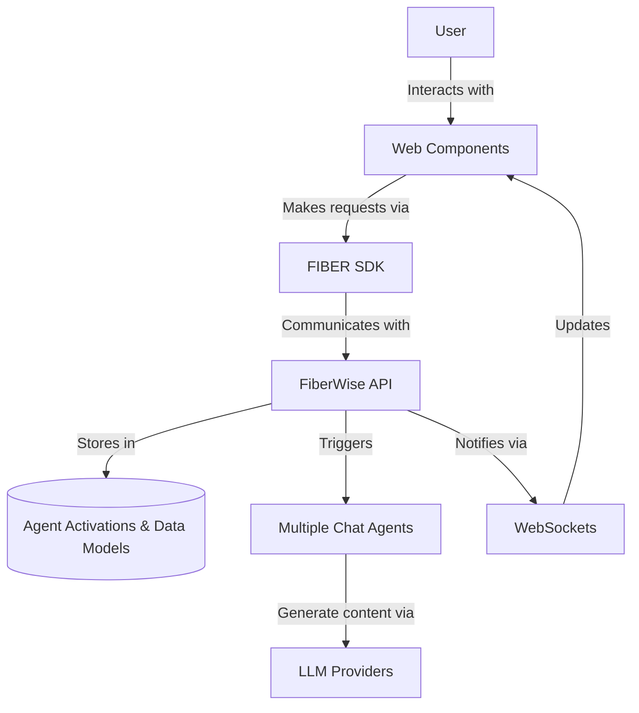

# Activation Chat Multi-Agent Review

I've reviewed the Activation Chat Multi-Agent application and prepared this updated document to provide a comprehensive overview of the system.

# Activation Chat Multi-Agent Review

## Overview

Activation Chat Multi-Agent is a sophisticated chat application built on the FiberWise platform that demonstrates:

1. Using agent activations as a message store
2. Dynamic data model integration for chat sessions
3. Multi-agent architecture for flexible response generation
4. Real-time updates via WebSockets
5. Web Components for modular UI design

The application leverages FiberWise's core infrastructure while providing a clean, extensible architecture that serves as a reference implementation for similar applications.

## Architecture Highlights

### Data Flow

The application uses a layered architecture:



### Key Components

1. **Web Components**:
   - `chat-app`: Root component orchestrating the entire application
   - `chat-messages`: Handles message display and updates
   - `chat-list`: Manages chat session selection and metadata
   - `chat-input`: Handles user input and submission

2. **Data Storage**:
   - Agent activations store message content with chat context
   - Dynamic data model (`chats`) stores session metadata
   - Provider configuration for LLM integration

3. **Agent System**:
   - Support for multiple agent types (LLM, custom)
   - Agent selection for different conversation models
   - Provider switching for different LLM backends

### Security Considerations

The application implements several security best practices:

- CSRF protection via tokens in both cookies and headers
- Secure cookie handling for authentication
- Content validation and sanitization
- Proper error handling and user feedback

## Implementation Details

### Communication Flow

1. **User Input**:
   - User types message in `chat-input`
   - Component dispatches `message-sent` event
   - `chat-app` receives event and processes

2. **Message Processing**:
   - `chat-app` creates activation via SDK
   - Message stored with appropriate context
   - Agent triggered based on selection

3. **Response Handling**:
   - Real-time updates via WebSocket events
   - Chat components updated with response content
   - UI refreshes to show new messages

### Data Models

The application uses a simple but effective data model structure:

1. **Chats Model**:
   - Primary model for session management
   - Contains title and metadata for chat sessions
   - Used to populate the chat list

2. **Activation Context**:
   - Links messages to specific chat sessions
   - Contains metadata about message type, provider, etc.
   - Enables filtering and querying of messages

## Agent Development

Agents can be created in two main ways:

1. **LLM Agents**: Simple pass-through to LLM providers with:
   - Configurable system prompts
   - Adjustable parameters (temperature, tokens)
   - Provider selection for different models

2. **Custom Agents**: Python-based implementation with:
   - Full SDK access for platform integration
   - Storage capabilities for stateful interactions
   - Custom logic for specialized use cases

Example agent implementation:

```python
class CustomChatAgent(BaseAgent):
    async def run_agent(self, input_data: Dict[str, Any], fiber: FiberWise) -> Dict[str, Any]:
        # Process input and generate response
        return {
            "text": "Generated response based on input: " + input_data.get("prompt", "")
        }
```

## Development Workflow

The project uses modern web development practices:

1. **Component-Based Development**:
   - Each component has HTML, CSS, and JS files
   - Clean separation of concerns
   - Isolated functionality and styling

2. **SDK Integration**:
   - Initialized in `index.js`
   - Available throughout the application
   - Abstracts backend communication

3. **Testing**:
   - Test agents included for development
   - CLI commands for agent activation

## Platform Integration Points

The application integrates with multiple FiberWise platform features:

1. **Authentication**: Automatic session handling
2. **Agent System**: Activation and management of agents
3. **Data Storage**: Session and message persistence
4. **Real-time Updates**: WebSocket notifications
5. **LLM Integration**: Multiple provider support
6. **Dynamic Data**: Flexible data models

## Extensions and Customization

The application is designed for extension in several ways:

1. **Adding New Providers**:
   - Extend the provider configuration
   - Implement provider-specific parameters

2. **Custom Agents**:
   - Create specialized agents for specific use cases
   - Implement complex conversation flows

3. **UI Customization**:
   - Modify the CSS for visual changes
   - Extend components for new features

4. **Data Model Extensions**:
   - Add fields to the chat model
   - Create related models for additional functionality

## Recommendations

Based on a review of the code, here are recommendations for further improvements:

1. **Streaming Support**: Enhance with token-by-token streaming for real-time responses
2. **Media Support**: Add capabilities for image and file attachments
3. **Export Functionality**: Implement direct export of chat history
4. **Accessibility**: Improve keyboard navigation and screen reader support
5. **Advanced Agents**: Implement tool-using agents with external API access
6. **Search Capability**: Add full-text search across chat history
7. **User Preferences**: Store and apply user preferences for chat behavior
8. **Mobile Optimization**: Enhance responsive design for better mobile experience

## Conclusion

The Activation Chat Multi-Agent application provides an excellent reference implementation for chat applications on the FiberWise platform. Its modular design, clean separation of concerns, and extensive use of platform features make it both a useful application and a valuable learning resource for developers.
s
This review document provides a comprehensive overview of the Activation Chat Multi-Agent application, highlighting its architecture, implementation details, and extension points. It combines information from the various existing documents while adding insights based on the code review.