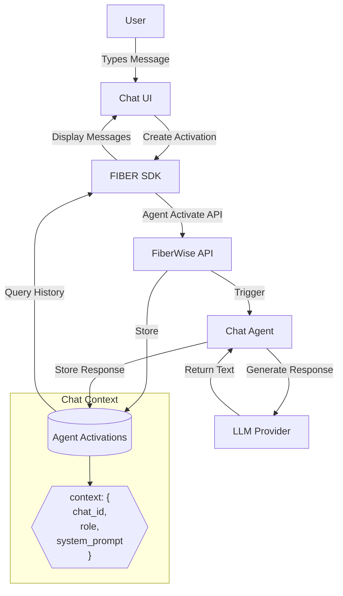
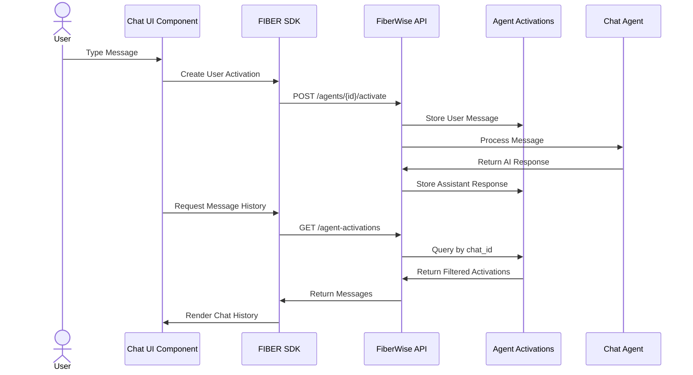

# Activation Chat

A chat application that leverages FiberWise's agent activation system as its backend storage mechanism, demonstrating how to use activations for chat functionality.


## Features

- **Session Management**: Create and manage chat sessions with customizable titles
- **Chat History**: View all previous conversations stored as agent activations
- **Multi-Agent Support**: Select and interact with different agents in the same chat
- **Auto-Agent Triggering**: Automatically trigger summarizer agents when starting new chats
- **Manual Agent Activation**: Trigger agents without requiring text input using the play button
- **Optional Input**: Send messages with empty content to allow agents to run autonomously
- **Agent Selector**: Choose specific agents from a dropdown menu for targeted interactions
- **Edit and Retry**: Edit previous messages and retry agent interactions with modified prompts
- **Message Management**: Delete messages permanently from the database with confirmation
- **Markdown Support**: Rich text formatting for AI responses
- **Responsive Design**: Works on both desktop and mobile devices
- **Real-time Updates**: WebSocket integration for live activation status updates

## Architecture

Activation Chat uses the agent activation system instead of a traditional database table for storing chat messages. This approach provides several benefits:

1. **Unified Storage**: Chat messages use the same data model as other AI interactions
2. **Context-Based Filtering**: Leverages the JSONB context field for rich metadata
3. **Built-in History**: Takes advantage of existing activation history features
4. **Simplified Backend**: No need for separate message tables or APIs

### System Diagram



## How It Works

### Message Storage

Each chat message is stored as an agent activation with special context metadata:

```json
{
  "context": {
    "chat_id": "unique-session-identifier",
    "session_title": "Chat Session Title",
    "role": "user|assistant|system",
    "system_prompt": "Instructions for the AI assistant"
  },
  "input_data": {
    "prompt": "User message or empty for auto-triggered agents"
  },
  "output_data": {
    "response": "Agent response or analysis"
  },
  "metadata": {
    "edit_chain": {
      "parent_activation_id": "uuid-of-original-message",
      "edit_generation": 1,
      "original_activation_id": "uuid-of-first-in-chain"
    }
  }
}
```

### Edit and Retry System

The application includes a comprehensive edit and retry system that allows users to modify previous messages and create new interactions:

1. **Edit Messages**: Click the edit button (✏️) on any message to modify the original prompt
2. **Retry Interactions**: After editing, send the modified prompt to create a new agent activation
3. **Edit Tracking**: The system tracks relationships between original and edited messages using metadata
4. **Visual Indicators**: Edited messages show an "(edited)" indicator for transparency
5. **Permanent Deletion**: Messages can be permanently deleted from the database with confirmation

#### Edit Chain Metadata

When a message is edited and retried, the new activation includes metadata tracking the edit relationship:

- **parent_activation_id**: ID of the message that was edited
- **edit_generation**: How many edits deep in the chain (0 = original, 1 = first edit, etc.)
- **original_activation_id**: ID of the very first message in the edit chain

This allows for complete edit history tracking and potential future features like edit history visualization.

### Agent Activation Modes

The application supports multiple ways to trigger agents:

1. **User-Initiated**: Traditional chat where user types a message
2. **Auto-Triggered**: Agents automatically activate when sessions are created
3. **Manual Trigger**: Users can activate agents without providing input text
4. **Empty Message**: Sending empty messages triggers agents with default prompts

### Sessions

Chat sessions are virtual entities derived from agent activations that share the same `chat_id` in their context. The app queries for unique session IDs to build the session list.

### Roles

Messages are distinguished by their `role` property:
- **User messages**: Messages sent by the user (`role: "user"`)
- **Assistant messages**: Responses from AI agents (`role: "assistant"`)
- **System messages**: Configuration messages (`role: "system"`)

### Agent Selection

Users can select different agents through the UI, allowing for:
- **Specialized Conversations**: Different agents for different topics
- **Multi-Agent Workflows**: Chain different agents in a single conversation
- **Autonomous Operation**: Agents can run without user input when triggered

## Getting Started

1. Install dependencies:
   ```bash
   npm install
   ```

2. Run the development server:
   ```bash
   npm run dev
   ```

3. Build for production:
   ```bash
   npm run build
   ```

## User Interface Components

### Agent Selector
- **Dropdown Menu**: Select from available agents in your application
- **Trigger Button**: Play button (▶️) to manually activate the selected agent
- **Auto-disable**: Components are disabled when no agents are available

### Chat Input
- **Optional Text Input**: Textarea with placeholder "Type your message here (optional)..."
- **Send Button**: Always enabled to allow empty message submissions
- **Auto-resize**: Input field grows with content up to a maximum height

### Message Display
- **Real-time Updates**: Messages appear as agents process them
- **Status Indicators**: Visual feedback for pending, completed, and failed activations
- **Agent Attribution**: Each message shows which agent generated it
- **Message Actions**: Each message has edit (✏️) and delete (🗑️) buttons for management
- **Edit Indicators**: Messages show "(edited)" label when they've been modified
- **Confirmation Dialogs**: Delete actions require confirmation to prevent accidental data loss

### Session Management
- **New Chat**: Creates fresh conversation sessions
- **Session List**: Browse previous conversations (stored in sidebar)
- **Auto-titling**: Sessions get automatic titles or user-defined names

## Usage Examples

### Creating a Chat Session

Click the "New Chat" button to create a session. You can specify a custom title for the session. The application will automatically trigger any available summarizer agents to begin analyzing the conversation.

### Selecting Agents

Use the agent dropdown selector at the bottom of the screen to choose which agent you want to interact with. Different agents may have specialized capabilities or knowledge domains.

### Chatting with Agents

Type your messages in the input field at the bottom of the screen and press Send or use Ctrl+Enter to submit. The input is optional - you can also trigger agents without any text input.

### Triggering Agents Without Input

1. **Automatic Triggering**: When you create a new chat session, summarizer agents will automatically start analyzing the conversation
2. **Manual Triggering**: Click the play button (▶️) next to the agent selector to trigger the selected agent without providing any text input
3. **Empty Message**: You can also click the send button with an empty message field to trigger the selected agent

### Editing and Managing Messages

#### Edit and Retry Messages
1. **Edit a Message**: Click the edit button (✏️) on any message you want to modify
2. **Modify Text**: A dialog will appear with the original message text - edit it as needed
3. **Submit Changes**: Click OK to populate the chat input with your edited text
4. **Send Retry**: Review and send the edited message to create a new agent interaction
5. **Visual Tracking**: The new message will show "(edited)" to indicate it's based on a previous message

#### Delete Messages
1. **Delete a Message**: Click the delete button (🗑️) on any message
2. **Confirm Deletion**: A confirmation dialog will appear warning that this action is permanent
3. **Permanent Removal**: Confirming will remove the message from the database entirely
4. **UI Update**: The message disappears immediately from the chat view

#### Edit Chain Tracking
- Messages created from edits maintain metadata linking them to their original messages
- Edit generation tracking allows for complex edit histories
- Future versions may include edit history visualization and comparison features

### Agent Types

- **Chat Agents**: Standard conversational agents that respond to user messages
- **Summarizer Agents**: Automatically analyze conversation history and provide insights
- **Specialized Agents**: Task-specific agents with particular knowledge domains

## Limitations and Future Work

- **Streaming**: Currently limited streaming support
- **Media**: No support for images or file attachments yet
- **Direct Export**: No built-in option for exporting chat history
- **Agent Icons**: Agent avatars and icons need enhancement for better visual identification
- **Loading States**: Additional loading indicators could improve user experience during agent processing
- **Edit History UI**: While edit tracking is implemented, there's no UI to view complete edit chains yet
- **Bulk Operations**: No support for bulk message operations (select multiple messages to delete/export)
- **Message Search**: No built-in search functionality within chat sessions

## Related Documentation

- [Agent Activations in FiberWise](../../docs/agent_activations.md)
- [Agent-Chat Architecture](../../docs/agent-chat-architecture.md)
- [Developer Guide](./DEVELOPER.md)


## Architecture Overview

### Component Flow



## Message Management Features

### Edit and Retry Workflow

The application now includes comprehensive message editing capabilities:

1. **Edit Button**: Each message displays an edit button (✏️) alongside the delete button
2. **Edit Dialog**: Clicking edit opens a browser prompt with the original message text
3. **Text Modification**: Users can modify the message text and confirm changes
4. **Input Population**: The edited text is automatically placed in the chat input field
5. **Retry Submission**: Users can review and submit the edited message to create a new activation
6. **Edit Tracking**: New activations include metadata linking them to their parent messages

### Delete Message Workflow

Messages can be permanently removed from the database:

1. **Delete Button**: Each message has a delete button (🗑️) for removal
2. **Confirmation Dialog**: A warning dialog confirms the permanent deletion
3. **Database Removal**: Confirmed deletions remove the activation from the database entirely
4. **UI Update**: The message immediately disappears from the chat interface
5. **No Recovery**: Deleted messages cannot be recovered - this is a permanent action

### Technical Implementation

- **Edit Metadata**: Uses the existing `metadata` field to store edit chain information
- **Parent Tracking**: `parent_activation_id` links edited messages to their originals
- **Generation Counting**: `edit_generation` tracks how many edits deep a message is
- **Visual Indicators**: "(edited)" labels appear on messages derived from edits
- **API Integration**: Leverages the backend DELETE endpoint for permanent message removal
