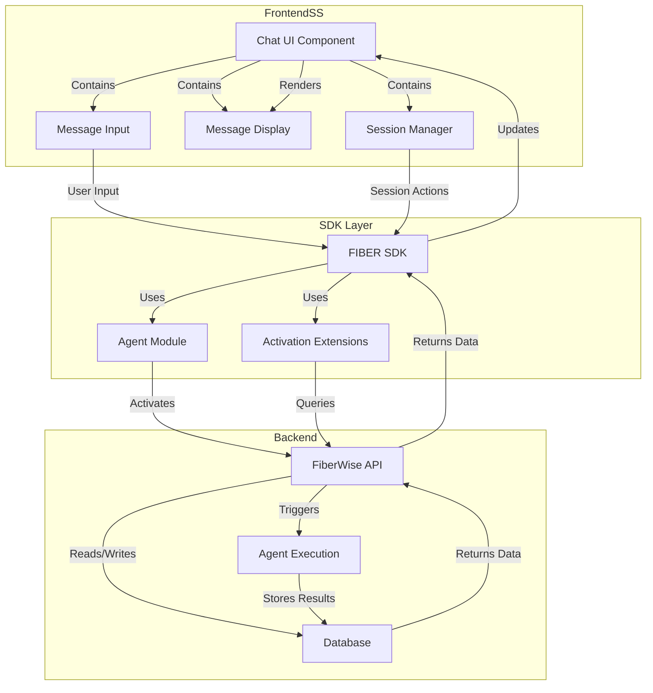
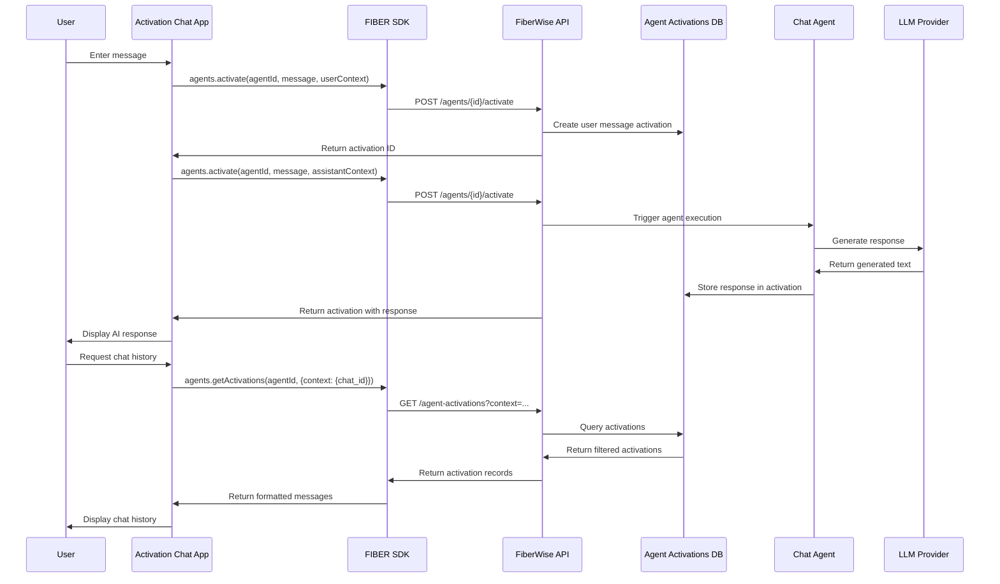
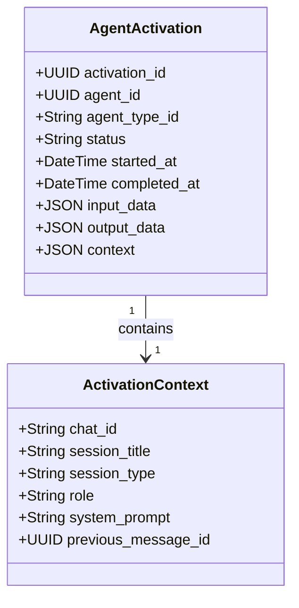
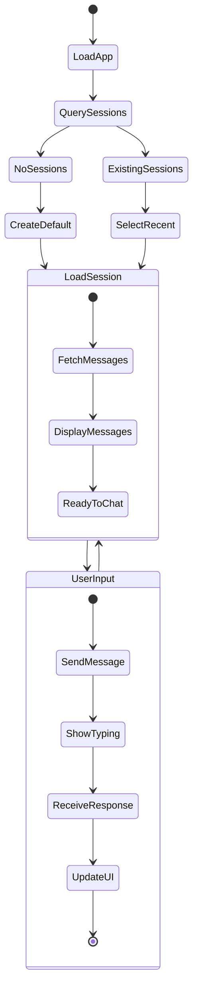
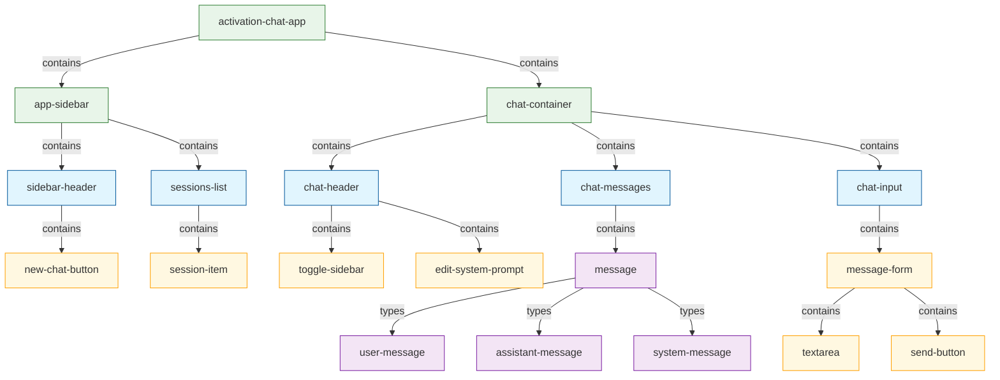
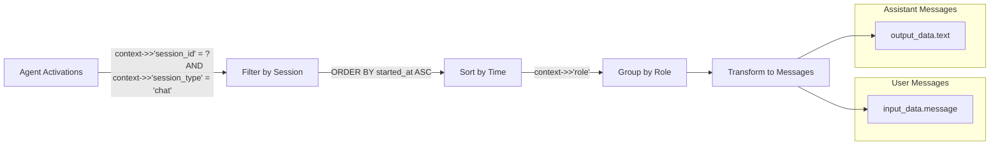

# Activation Chat Architecture

This document provides detailed technical diagrams explaining how the Activation Chat app is structured and how it uses agent activations as a chat message store.

## System Architecture

## Data Flow Diagram

## Context Data Structure

## Session Management Flow

## Component Tree

## Context-Based Message Retrieval

